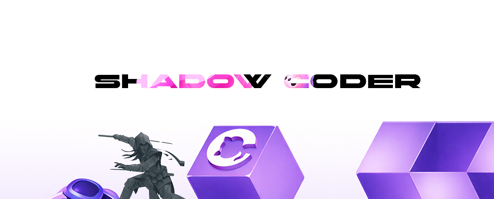

Задание: «Веб-пианино»
<h2>👥 Студенты</h2>
<ul> 
  <li>Student ID: #FD-241001-013 — Рауль </li>
</ul>

<h1> 📝 Тема: Разработка интерактивного пианино на HTML, CSS и JavaScript</h1>

Example: Piano Web App
Описание задачи:
Необходимо создать полноценное веб-приложение «Пианино», где пользователь сможет играть на пианино, нажимая на клавиши мышью или с клавиатуры. Приложение должно содержать визуальный интерфейс клавиш, отображать их состояния при нажатии и воспроизводить соответствующие звуки.

Пользовательский интерфейс должен быть аккуратным и интуитивно понятным, клавиши должны быть разделены на белые и черные, как в настоящем пианино. Приложение должно быть интерактивным и отзывчивым, чтобы пользователь ощущал плавность игры.
Приложение должно позволять добавлять простые функции, такие как изменение октавы, использование клавиатуры для игры и визуальная подсветка нажатых клавиш.

<pre>
📁 Структура проекта
index.html
styles.css
script.js
assets/ (звуки клавиш, иконки)
README.md
</pre>

 
📤 Сдача
 
Отправить репозиторий GitHub или архив ZIP.
 
⏳ Дедлайн: 14 дней
 <a href="https://www.eyecodeuniversity.ru">www.eyecodeuniversity.ru</a> 

