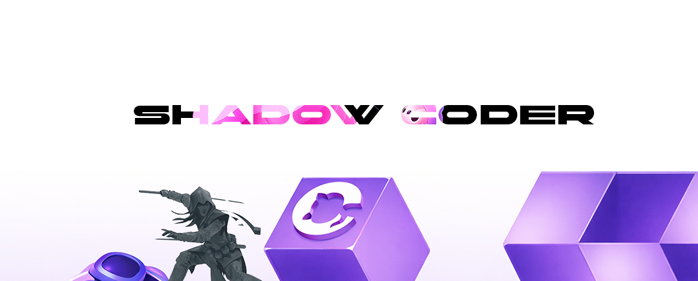

# Задание: Кликер по типу Bloom

> **Task ID:** `e2a7d4f9-5`

| StudentID | ФИО |
|------|-------------------|
| #FD-241001-013 | Рауль Фахратдинов |


---

## Суть задания

Создай **кликер-игру** по типу Bloom (Telegram игра). Пользователь кликает на объект, зарабатывает монеты, может покупать улучшения для автоматического заработка и увеличения дохода за клик.

---

## Выбери тему

| Тема | Главный объект |
|------|----------------|
| 🌸 **Цветок** | Растущий цветок (как в Bloom) |
| 🍪 **Печенька** | Cookie Clicker стиль |
| 💎 **Кристалл** | Магический кристалл |
| 🌳 **Дерево** | Растущее дерево |

---

## 📋 Основная механика

### 1️⃣ Система кликов

**При клике на объект:**
- Анимация (scale, pulse)
- +1 монета к балансу
- Визуальный эффект (+1 всплывающая цифра)
- Звук клика (опционально)

**Энергия:**
```
┌──────────────────────┐
│ ⚡ Энергия: 85/100   │
└──────────────────────┘
```
- Каждый клик = -1 энергия
- Восстановление: +1 энергия каждые 3 секунды
- Без энергии кликать нельзя

---

### 2️⃣ Улучшения

| Улучшение | Эффект | Начальная цена |
|-----------|--------|----------------|
| **Авто-клик** | +1 монета/сек | 50 монет |
| **Множитель клика** | Клик даёт x2 монет | 100 монет |
| **Максимум энергии** | +10 к лимиту энергии | 75 монет |
| **Скорость восстановления** | Энергия быстрее x1.5 | 150 монет |

**Механика цен:**
```javascript
// Цена растёт с каждой покупкой
newPrice = basePrice * Math.pow(1.15, level)
```

---

### 3️⃣ Интерфейс

```
┌─────────────────────────────────┐
│  💰 Баланс: 1,250               │
│  ⚡ Энергия: 85/100              │
├─────────────────────────────────┤
│                                 │
│         [  🌸  ]                │
│      (кликабельный объект)      │
│                                 │
├─────────────────────────────────┤
│  Улучшения:                     │
│  ┌─────────────────────┐        │
│  │ Авто-клик  Lvl 5    │        │
│  │ +5 монет/сек        │        │
│  │ [Купить за 150💰]   │        │
│  └─────────────────────┘        │
└─────────────────────────────────┘
```

---

### 4️⃣ Логика автоматического дохода

```javascript
// Каждую секунду
setInterval(() => {
  const income = autoClickLevel * 1; // уровень * доход
  balance += income;
  updateBalance();
}, 1000);
```

---

### 5️⃣ Визуальные эффекты

| Эффект | Когда применять |
|--------|-----------------|
| **Pulse анимация** | При клике на объект |
| **Всплывающая цифра** | Показывает +1, +2 и т.д. |
| **Shake** | Когда нет энергии |
| **Glow** | Когда доступно улучшение |
| **Progress bar** | Для энергии |

---

## 🎯 Обязательные фичи

**Сохранение прогресса:**
```javascript
// LocalStorage
const saveGame = () => {
  localStorage.setItem('gameData', JSON.stringify({
    balance,
    energy,
    upgrades
  }));
};

// Автосохранение каждые 5 секунд
setInterval(saveGame, 5000);
```

**Система достижений (опционально):**
- "Первый клик" — сделай 1 клик
- "Трудяга" — сделай 100 кликов
- "Богач" — накопи 1000 монет
- "Автомат" — купи 10 уровень авто-клика

---

## 📦 Структура проекта

```
bloom-clicker/
├── index.html
├── style.css
├── script.js
└── assets/
    ├── flower.png
    └── click-sound.mp3
```

---

## ✅ Чеклист перед сдачей

| Проверка | Статус |
|----------|--------|
| Клик на объект работает | ☐ |
| Баланс обновляется правильно | ☐ |
| Система энергии работает | ☐ |
| Энергия восстанавливается | ☐ |
| Минимум 4 улучшения | ☐ |
| Автоматический доход работает | ☐ |
| Цены растут с уровнем | ☐ |
| Прогресс сохраняется (localStorage) | ☐ |
| Есть анимации кликов | ☐ |

---

## 📤 Как сдать

| Способ | Что делать |
|--------|------------|
| **ZIP** | Упакуй все файлы в архив и отправь |

> ⏳ **Дедлайн:** 14 дней с момента получения задания

---

<div align="center">

### 🎓 Удачи в разработке!

**Вопросы?** Пиши в чат курса

[www.eyecodeuniversity.ru](https://www.eyecodeuniversity.ru)

</div>

